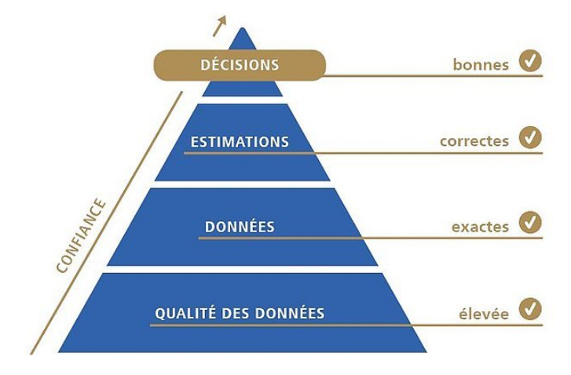

# Contrôle Qualité (Stéphane Rolle)

Si la qualité des données en amont n'est pas bonne alors le reste sera tout aussi moins bon voir pire 




Quand on évaluer une donnée il faut vérifier son environnement

**STANDARD = Préconisations** Il établit un référentiel commun et documenté destiné à harmoniser l'activité d'un secteur.

**NORMES = Obligations**

## Les normes ISO

- **ISO 19115** : Norme information géographiqe dans les métadonnées. C'est une norme de référence pour l'information géographique dans le domaine des métadonnées. Cette norme est notamment utilisée en agriculture pour le registre parcellaire graphique.
- **ISO 19139** : Norme métadonnées similaire
- **ISO 19157** : Norme Qualité des données
- **Directive INSPIRE** : Cette directive vise à établir en Europe une infrastructure de données géographiques pour assurer l’interopérabilité entre les bases de données. Elle assure l'intéropérabilité des données et facilite la diffusion, la disponibilité. Elle est accessible via des Services Web

5 principaux services définis par son article 11 : 
- recherche, 
- consultation, 
- téléchargement, 
- transformation, 
- appel de services

## La norme 19157 la qualité des données géographiques

Elle a plusieurs critères

- Exhaustivité
- Précision thématique
- Cohérence logique
- Précision de position
- Cohérence temporelle

## Les Qualités

- Qualité interne = Ecart entre les spécifications et la production des données
- Qualité externe = Aptitude d'un jeu de données à satisfaire un usage donné : La qualité perçue pour un usage spécifique

### Qualité interne

**Niveau d’adéquation entre donnée produite et donnée optimale**

- Recherche sur l'incertitude
- Possibilité de mesurer les écarts définit par un niveua d'erreur acceptable
- Erreur de positionnement : Diffusion exponentielle de l'erreur

C'est le passage du monde réel au monde nominal par le biais de spécifications précises. Ainsi tout n'est pas représenté mais ce qui est représenté est juste.

**Exemple :**

Le code de l’urbanisme conditionne le standard qui conditionne le GPU

### Qualité Externe

**Niveau d’adéquation entre la donnée et besoin de l’utilisateur**

**Norme définissant les critères et méthodes, échelle locale, nationale…européenne**

Utilisabilité de la donnée

## Les référentiels

### Contrôler avec un référentiel

**IMPORTANT**

Réutiliser une donnée, c'est réutiliser les éventuelles erreurs

**=>** On corrige les erreurs ou alors on argumente sur le slimites de l'étude

Pour l'exhaustivité, la qualité doit être supérieur ou égal à la qualité des données à Contrôler
Pour la précision, elle doit être supérieure

### Contrôler sans référentiel

1. le contrôle terrain

| + | - |
|:---:|:---:|
| Exhaustivité, précision thématique, qualité temporelle, précision de position | Omissions, caractéristique administrative, réglementaire, coûteux |

2. le dire d'expert

| + | Attention |
|:---:|:---:|
| Connaissance du terrain, Connaissance de la thématique | Doit être commenté, Estimation, Fournir un intervalle de confiance (subjectif) |

### Le mode de production de la donnée, sa généalogie

- Elle fournit qu’une estimation de la qualité
- Rarement renseignée
- Peut être le dernier recours pour évaluer la qualité
- Accessible via les métadonnées

J’analyse le mode de production de la donnée pour savoir si elle peut être de qualité et/ou je regarde de quel process, ou de quelles données elle découle

### L’analyse thématique


## Les critères de qualité et ses méthodes

### Les mesures

Le type de mesuLe type de mesure dépend de la nature des éléments de qualité.re dépend de la nature des éléments de qualité.

- Présence ou non d’un élément (booléen)
- Caractère qualitatif ou quantitatif d’un attribut (nombre ou taux en %)
- Précision relative ou absolue (nombre ou taux en %)

### Les méthodes d'évaluation

**La méthode** décrit les procédures et les traitements appliqués aux données pour parvenir à un résultat de la mesure de la qualité.

**Le contexte** donne :
- L’existence ou non de spécifications
- L’existence ou non d’une source de référence

Ainsi : 

**Une mesure => Une méthode d'évaluation => Un résultat**

### Les méthodes d'échantillonage

**Lot :** Lot de données à évaluer
- **Objet :** Unité minimale
	- **Strate :** Sous-emprise géographique de données homogènes
		- **Echnatillon : ** Sous-ensemble représentatif du lot

#### Les critères d'échantillonage
- Le nombre d'Objet
- La surface couverte
- L'emplacement

#### Les stratégies d'échantillonage

| Déterministe | Probabiliste |
|:---|:---|
| Orienté entité | Simple aléatoire|
| Orienté surface | Semi-aléatoire |
| Orienté surface et entité | Aléatoire stratifié |

**Le lot est considéré comme homogène si :**
- Données source de qualité homogène
- Processus de production constant
- Causes de non-conformité constantes

#### Définir les échantillons

L’effectif minimal de l’échantillon (n) dépend de :
- De la taille du jeu de données
- Du niveau de rejet associé (LAQ)
- Du niveau de confiance recherché (95%....)

S’applique pour :
- recherche d’éléments conformes/non-conformes (exhaustivité, précision thématique)
- Incluant un calcul d’écart-type (précision de position)

Si pas de respect de ces règles d’échantillonnage minimal :
- Pas de comparaison possible avec un LAQ

#### processus théorique d'échantillonage

1. Définir les objets et/ou thématiques et/ou emprises à contrôler
2. Découper le lot de données en sous-lots homogènes
3. a. Échantillonnage aléatoire simple
3. b. Échantillonnage semi-aléatoire
3. c. Échantillonnage aléatoire stratifié
4. Tirage aléatoire des échantillons
5. Contrôler tous les éléments des échantillons sélectionnés

#### Conclusion
|||
|---------|---------|
| Effectif peu important ou exigence qualité élevée | Contrôle systématique |
| Autres cas | Échantillonnage: Identifier des strates, Redresser les résultats, LAQ et niveau de confiance |

## Les 5 NORMES

### Exhaustivité
#### L'excedent
Données excédentaires d’un jeu de données

|Designation calcul|Type|
|---------|---------|
|Elements en excès|Booléen|
|Nombre d'éléments en excès|INT|
|Taux d'éléments en excès|Pourcentage|
|Nombres d'instancess d'entités dupliquées|INT|

#### L'omission
Données manquantes d’un jeu de données

|Designation calcul|Type|
|---------|---------|
|Elements manquants|Booléen|
|Nombre d'éléments manquants|INT|
|Taaux d'éléments manquants|Pourcentage|

#### Taux d'exhaustivité

### La cohérence temporelle

**L'exactitude de la mesure temporelle :** Mesures temporelles décrites
**Cohérence temporelle:** Justesse chronologique Ex: L’heure d’ouverture d’un magasin ne peut pas être postérieur à sa date de fermeture
**Validité temporelle :** Aspects temporels Ex: 29 février 2017 n'existe pas

### Cohérence Logique

**Degré de cohérence interne selon les règles de modélisation et les spécifications**
#### La cohérence conceptuelle 
Elle définit le respect du schéma conceptuel des données
- Conformité au schéma conceptuel
- Nombre d’éléments conformes aux règles du schéma conceptuel
- Taux de conformité par rapport aux règles du schéma conceptuel
- Nombre de chevauchements de surfaces non valides

**Indicateurs souhaités**
description littérale des anomalies constatées

#### La cohérence au domaine de valeur 
Elle vérifie l’appartenance des valeurs d’attributs aux plages de valeurs spécifiées : Ensemble des valeurs autorisées pour un attribut
- Conformité au domaine de valeur
- Nombre d’éléments conformes au domaine de valeur
- Taux de conformité au domaine de valeur
- Taux de non-conformité au domaine de valeur

**Indicateurs souhaités**
taux de conformité aux domaines de valeurs

#### La cohérence de format 
Elle est l’adéquation avec la structure physique attendue du jeu de données : Nom, type et taille des attributs
- Conflit de structure physique
- Nombre de conflits de structure physique
- Taux de conflits de structure physique

Pratique d’utiliser des commandes shell, dos, python..
On peut detecter des incoherences avec ogrinfo par Exemple

pour la recherche de mots précis ou lettres etc.. https://regexr.com/

**Indicateurs souhaités**
taux de conflit de structure physique


#### La cohérence topologique 
Elle est l’exactitude des caractéristiques topologiques du jeu de données.
- Nombre de connexions arc-nœud erronés
- Taux de connexions arc-nœud erronés
- Nombre de connexions manquantes en raison de ligne trop courte
- Taux de connexions manquantes en raison de ligne trop longue
- Nombre d’auto-intersections non valides
- Nombre de micro-surfaces non valides
- Nombre d’erreurs de chevauchement sur la même couche

Mesures complémentaires
**Indice de compaxcité**
```
Q=(4 * pi() * $area) / ($perimeter * $perimeter)
```
Si Q proche de 0 on a une forme très irrégulière
Si Q proche de 1 on a une forme compacte

**Le coefficient d'épaisseur**
```
(2 * $area) / $perimeter
```
< 2 m → ⚠️ parcelle anormale
2–5 m → parcelle très étroite (chemin, résidu)
5–15 m → parcelle allongée
15 m → parcelle « normale »

**Indicateurs souhaités**
- taux de connexions erronées
- nombre de micro-surfaces non valides
- nombre d’auto-intersections non valides
- nombre d’erreurs de chevauchement

### Précision Thématique

#### Mesure de la justesse du classement
- Nombre d’entités classées de manière incorrecte
- Taux de classement erroné : Nombre d’entités classées de manière incorrecte par rapport au nombre total d’entités
- Matrice de classement erroné : MCM (i,j)
- Coefficient KAPPA
- Matrice relative de classement erroné : RMCM

#### Justesse des attributs non quantitatifs
- Nombre de valeurs d’attributs incorrectes

Evitez les erreurs avec :
- Formulaire
- Liste de référentiel
- Valeurs par défaut

### Précision de position

 Voir cours
 
## Les validateurs et chaines de traitements

**Validateur :** Fonction, logiciel, script permettant de confronter des données à des spécifications techniques décrites (et documentées).

**Une chaine de traitement :** Ensemble d’actions permettant d’aboutir à un résultat de manière ordonnée. Le traitement peut ainsi etre rejoué, quelque soit l’entrée du modèle.
