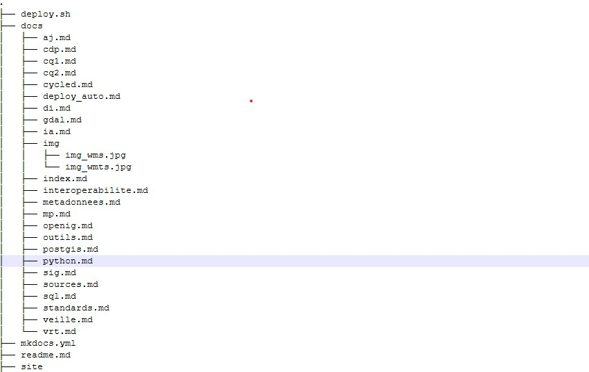

# Les métadonnées

**Enjeux** : Très important pour l'avenir du métier

Les métadonnées se partagent.

## La métadonnée, c'est la desciption de la donnée :

Une métadonnée (mot composé du préfixe grec meta, indiquant l’auto-référence ; le mot signifie donc proprement « donnée de/à propos de donnée ») est une donnée servant à définir ou décrire une autre donnée quel que soit son support (papier ou électronique).

- Date d'envoi, de création, taille du fichier, l'auteur ...
- Pour nous géomaticiens : Pour une photo, les métadonnées sont la position de la photo x,y, la résolution etc...

Qu'est ce qu'il y a dans la table attributaire, décrire les champs, 
Dans une carte, c'est la légende, l'échelle, 


La métadonnée doit répondre au **QUI , QUOI , QUAND, OU et COMMENT**


- Origine des données et identité du créateur
- Conditions et objectifs de la collecte des données
- Références de temps et de localisation
- Conditions d'accès et modalités d'utilisation

=> C'est une clef de lecture pour trouver , comprendre et analyser la données. C'est de la valorisation de données

## 3 OBJECTIFS

- Le maintient de la mémoire sur le patrimoine informationnel

- **Un besoin opérationnel interne** : les métadonnées permettent aux utilisateurs internes d'accéder au patrimoine d'information disponible dans le service par le biais de catalogues de données, de documents techniques extraits des métadonnées 

- **L'information des utilisateurs externes** : Les métadonnées permettent de la même façon de fournir à des utilisateurs externes les principales informations sur les données que le service est susceptible de lui fournir

### Convention d'achanges de données  = Définit l'utilisation de la donnée. L amétadonnée pour enrichir cette convention

## La forme 

- La structure répond a des standards : simplifie la lecture et analyse des métadonnées.

- Des logiciles permettent l'implémentation de standards : 

## POUR QUI ?
- soi même : traces

- Collègues : 

	- savoir qu'elle existe pas faire 2 fois
	- Auteur ? De quoi est faite la donnée ?

- Partenaires (organismes entreprises)

	- Droits d'utilisation ?
	- Qui contacter ?
	- Comment obtenir la donnée ?
	
- Etat, Union européenne

	- Contraintes de catalogage
	- Besoin d'interropérabilité treansfrontalière (INSPIRE)


Partager de la donnée n'est pas tout simple, il faut créér des métadonnées mais aussi il faut une infra
Afin de partager 

**OPEN DATA SOFT logiciel de métadonnées HUWISE**

logiciel tree 

```
(.venv) idgeo@GS11:/mnt/d/olivier/git_work/prise_note$ tree >> tree.md

```
https://just-sudo-it.be/tree-afficher-larborescence-des-fichiers-et-dossiers/



### 3 standards 
Pour évaluation normes ISO 19115  **QCM**

- ISO 19115 : normalise le contenu des métadonnées

Profil ISO Core 22 éléments qui constitue le noyau dont 7 obligatoires et 15 optionnels
les 7 répondent au qui quoi, ...

- ISO 19139 : normalise la syntaxe xml des métadonnées

- Catalogue Service for Web (CS-W) : permet d'interroger et lire un géo-catalogue en ligne

### Autre standard : DCAT

Jean Pommier solution
https://github.com/pi-geosolutions/vrt2rdf?tab=readme-ov-file#vrt2rdf

**L'ambition de DCAT est de faciliter l'interopérabilité entre les catalogues et les données publiés sur le web.**
Normalisation pour le Web
DCAT se base sur une syntaxe RDF (sémantique)

Derrière il  y a le RDF (reassource description framework) web semantique, c'est un modèle de données **PAS** un format

Le CNIG participe à la réflexion et a un Groupe de Travail dédié au sujet. On y retrouve les ressources complètes de leur travaux : https://cnig.gouv.fr/metadonnees-r21413.html


Un projet de mapping du schéma INSPIRE vers DCAT => https://github.com/cnigfr/metadonnee/tree/main/MappingINSPIRE-DCAT

On y trouve également un guide de saisie pour remplir des éléments Inspiro Compatibles : http://cnig.gouv.fr/wp-content/uploads/2019/12/Guide-de-saisie-des-%C3%A9l%C3%A9ments-de-m%C3%A9tadonn%C3%A9es-INSPIRE-v2.0-1.pdf


### Création des métadonnées

Dans le cadre de la norme ENV ISO 19115, les métadonnées portent plus particulièrement sur le contenu :

- des informations d'**identification** de la ressource : **intitulé, description, dates de référence, version, résumé, intervenants**

- des informations plus **techniques** : **la description de l'étendue géographique de la ressource, des aperçus, des informations sur les emplois possibles, systèmes de projection ...**

- des informations sur la **qualité**, organisées en :

	- mesures de qualité relatives aux critères habituels : précision géométrique, temporelle et sémantique, exhaustivité, cohérence logique ;

	- informations de généalogie : description des sources et des processus appliqués aux sources.

- des informations sur les **modalités de diffusion** : **coût de diffusion, modes d'accès, supports, formats, contraintes légales ...**

- des informations sur les **métadonnées** elles mêmes : **date de rédaction, auteur, langue ...**

1. IDENTIFICATION

	1.1. Intitulé de la ressource

Nom caractéristique et souvent unique sous lequel la ressource est connue.

	1.2. Résumé de la ressource

Bref résumé narratif du contenu de la ressource.

	1.3. Type de ressource

Type de ressource décrit par les métadonnées.

	1.4. Localisateur de la ressource

Le localisateur de la ressource définit le ou les liens avec la ressource et/ou le lien avec les informations supplémentaires concernant la ressource.

Le domaine de valeur de cet élément de métadonnées est une chaîne de caractères couramment exprimée sous forme de localisateur de ressource uniforme (Uniform Resource Locator, URL).

	1.5. Identificateur de ressource unique

Une valeur identifiant la ressource de manière unique.

Le domaine de valeur de cet élément de métadonnées est un code obligatoire sous forme de chaîne de caractères, généralement attribué par le propriétaire des données, et un espace de noms sous forme de chaîne de caractères qui identifie de manière unique le contexte du code d'identification (par exemple le propriétaire des données).

	1.6. Ressource couplée

Si la ressource est un service de données géographiques, cet élément de métadonnées identifie, le cas échéant, la série ou les séries de données géographiques cibles du service grâce à leurs identificateurs de ressource uniques (Unique Resource Identifiers, URI).

	1.7. Langue de la ressource

La langue ou les langues utilisées dans le cadre de la ressource

2. CLASSIFICATION DES DONNÉES ET SERVICES GÉOGRAPHIQUES

	2.1. Catégorie thématique

Ce champ permet de classer la ressource dans une ou plusieurs catégories d'une liste fermée et internationale, facilitant ainsi la recherche de cette donnée. Il est important d'associer la ressource à la (ou les) thématique la plus pertinente.

	2.2. Type de service de données géographiques

Cas habituels :

Un service CSW est un « service de recherche »,

un service WMS est un « service de consultation »

et un service WFS est un « service de téléchargement ».

Un service WPS faisant du géotraitement (par exemple : chaînage de d'éléments hydrographiques ou croisement de couche) sera de type « autre ».

3. MOT CLÉ

Liste de mots-clés (s'inspirer du site https://www.eionet.europa.eu/gemet/en/inspire-themes/)

4. SITUATION GÉOGRAPHIQUE
	
	4.1. Rectangle de délimitation géographique

Étendue de la ressource dans l'espace géographique, exprimée sous la forme d'un rectangle de délimitation.

Ce rectangle de délimitation est défini par les longitudes est et ouest et les latitudes sud et nord en degrés décimaux, avec une précision d'au moins deux chiffres après la virgule.

5. RÉFÉRENCE TEMPORELLE
Au moins un des éléments de métadonnées indiqués aux points 5.1 à 5.4 devra être fourni.

	5.1. Étendue temporelle

L'étendue temporelle définit la période de temps couverte par le contenu de la ressource. Cette période peut être exprimée de l'une des manières suivantes:

une date déterminée,

un intervalle de dates exprimé par la date de début et la date de fin de l'intervalle,

un mélange de dates et d'intervalles.

	5.2. Date de publication

Date de publication de la ressource lorsqu'elle est disponible ou date d'entrée en vigueur. Il peut y avoir plus d'une date de publication.

	5.3. Date de dernière révision

Date de la dernière révision de la ressource, si la ressource a été révisée. Il ne doit pas y avoir plus d'une date de dernière révision.

	5.4. Date de création

Date de création de la ressource. Il ne doit pas y avoir plus d'une date de création.

6. QUALITÉ ET VALIDITÉ

	6.1. Généalogie

La généalogie fait état de l'historique du traitement et/ou de la qualité générale de la série de données géographiques.

Le cas échéant, elle peut inclure une information indiquant si la série de données a été validée ou soumise à un contrôle de qualité, s'il s'agit de la version officielle (dans le cas où il existe plusieurs versions) et si elle a une valeur légale.

	6.2. Résolution spatiale

La résolution spatiale se rapporte au niveau de détail de la série de données. Elle est exprimée comme un ensemble de valeurs de distance de résolution allant de zéro à plusieurs valeurs (normalement utilisé pour des données maillées et des produits dérivés d'imagerie) ou exprimée en échelles équivalentes (habituellement utilisées pour les cartes ou les produits dérivés de cartes).

7. CONFORMITÉ
Les exigences en ce qui concerne la conformité et le degré de conformité avec les règles de mise en œuvre adoptées par INSPIRE:

	7.1. Spécification

Indication de la référence des règles de mise en œuvre de la directive ou des autres spécifications auxquelles une ressource particulière est conforme.

Une ressource peut être conforme à plusieurs règles de mise en œuvre adoptées par la directive ou à d'autres spécifications.

Cette indication inclut au moins le titre et une date de référence (date de publication, date de dernière révision ou de création) des règles de mise en oeuvre adoptées par la directive ou des autres spécifications auxquelles la ressource est conforme.

	7.2. Degré

Degré de conformité de la ressource par rapport aux règles de mise en œuvre adoptées par la directive ou à d'autres spécifications.

8. CONTRAINTES EN MATIÈRE D'ACCÈS ET D'UTILISATION

Une contrainte en matière d'accès et d'utilisation peut être l'un des deux éléments suivants ou les deux :

	8.1. Conditions applicables à l'accès et à l'utilisation

Cet élément de métadonnées définit les conditions applicables à l'accès et à l'utilisation des séries et des services de données géographiques, et, le cas échéant, les frais correspondants.

Cet élément doit avoir des valeurs. Si aucune condition ne s'applique à l'accès à la ressource et à son utilisation, on utilisera la mention «aucune condition ne s'applique». Si les conditions sont inconnues, on utilisera la mention «conditions inconnues».

Cet élément fournira aussi des informations sur tout frais éventuel à acquitter pour avoir accès à la ressource et l'utiliser, le cas échéant, ou fera référence à un localisateur de ressource uniforme (Uniform Resource Locator, URL) où il sera possible de trouver des informations sur les frais.

	8.2. Restrictions concernant l'accès public

Lorsque les producteurs restreignent l'accès public aux séries et aux services de données géographiques, cet élément de métadonnées fournit des informations sur les restrictions et les raisons de celles-ci.

S'il n'y a pas de restrictions concernant l'accès public, cet élément de métadonnées l'indiquera.

9. ORGANISATIONS RESPONSABLES DE L'ÉTABLISSEMENT, DE LA GESTION, DE LA MAINTENANCE ET DE LA DIFFUSION DES SÉRIES ET DES SERVICES DE DONNÉES GÉOGRAPHIQUES

	9.1. Partie responsable

Description de l'organisation responsable de l'établissement, de la gestion, de la maintenance et de la diffusion de la ressource.

Cette description inclut:

description sous forme de texte libre,

une adresse e-mail de contact sous la forme d'une chaîne de caractères.

	9.2. Rôle de la partie responsable

Fonction de l'organisation responsable.

La norme EN ISO 19115 identifie les responsabilités élémentaires suivantes : le fournisseur, le gestionnaire, le propriétaire, l'utilisateur, le distributeur, le commanditaire, le point de contact, le maître d’œuvre principal (ou d'ensemble), l'exécutant secondaire, l'éditeur et l'auteur.

Ces responsabilités élémentaires recouvrent d'autres notions très utilisées en France, notamment :

Le maître d'ouvrage correspond généralement au commanditaire de la ressource et peut accessoirement en être le propriétaire ;

Le producteur en tant que fabricant correspond au maître d’œuvre principal ;

L'intégrateur de la ressource peut correspondre au gestionnaire et/ou maître d’œuvre principal de la ressource.

10. MÉTADONNÉES CONCERNANT LES MÉTADONNÉES

	10.1. Point de contact des métadonnées

Description de l'organisation responsable de la création et de la maintenance des métadonnées. Cette description inclut:

le nom de l'organisation sous forme de texte libre,

une adresse e-mail de contact sous la forme d'une chaîne de caractères.

	10.2. Date des métadonnées

Date à laquelle l'enregistrement de métadonnées a été créé ou actualisé.

	10.3. Langue des métadonnées

C'est la langue dans laquelle les éléments de métadonnées sont exprimés

